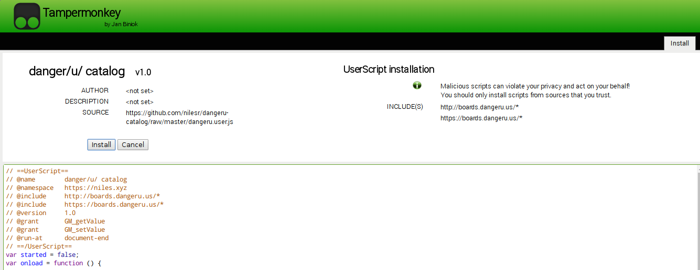

## Small userscript to browse danger/u/ more efficiently, based on lainmod

It keeps track of how many replies a post has, and shows the number of new replies in red when there are new ones. It marks a post as fully read when you click on it in the list.

It caches the number of replies on closed posts to save bandwidth

It will also show deleted posts, and if you had seen the post before it was deleted it will tell you the title.

PREFETCHER NOTICED ME

## How to install on chrome

Step 1 - Install greasemonkey from the chrome web store [here](https://chrome.google.com/webstore/detail/tampermonkey/dhdgffkkebhmkfjojejmpbldmpobfkfo?hl=en)

Step 2 - Click [here](https://github.com/nilesr/dangeru-catalog/raw/master/dangeru.user.js)

Step 3 - Click install on this screen:

Step 4 - Go to [https://boards.dangeru.us/lain](boards.dangeru.us/lain) and make sure it works
